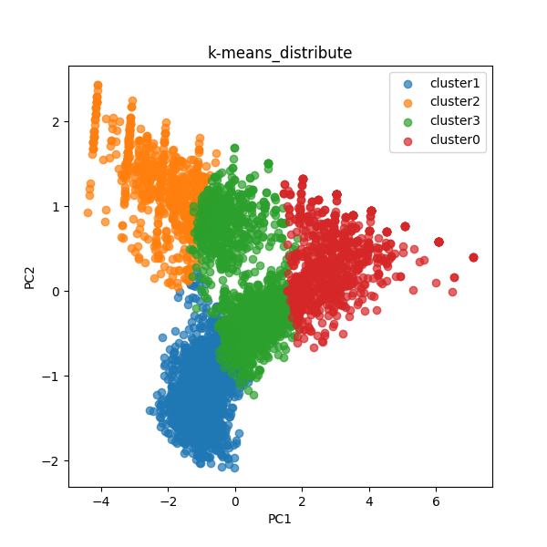
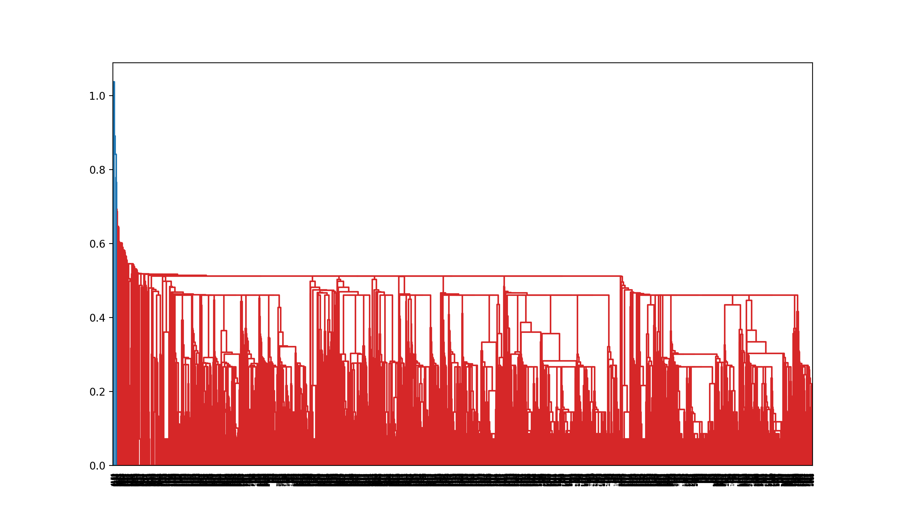
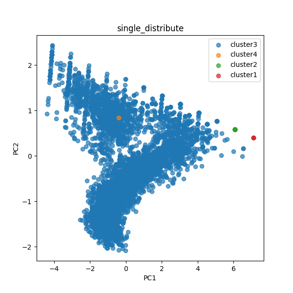
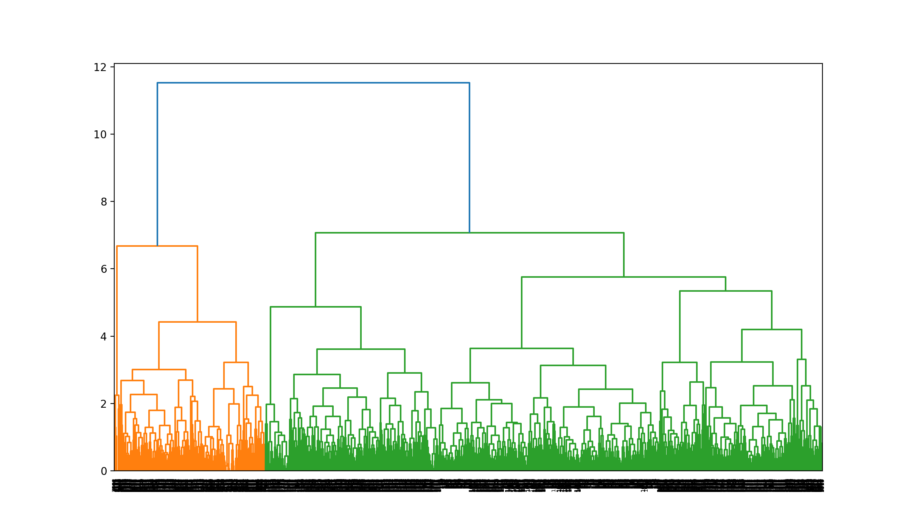
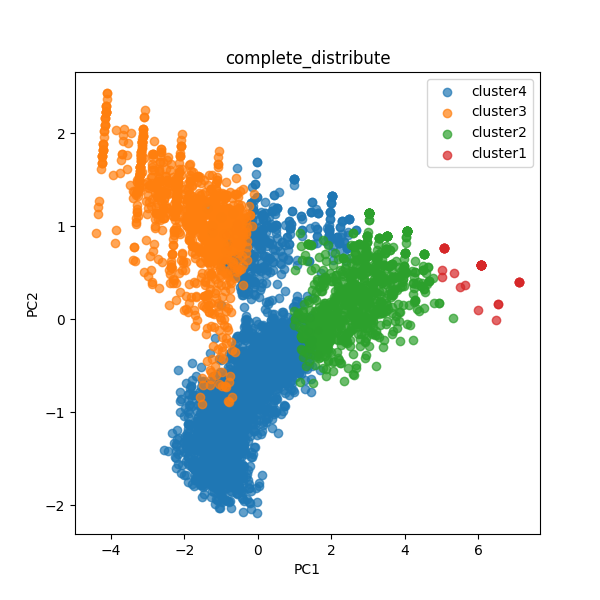
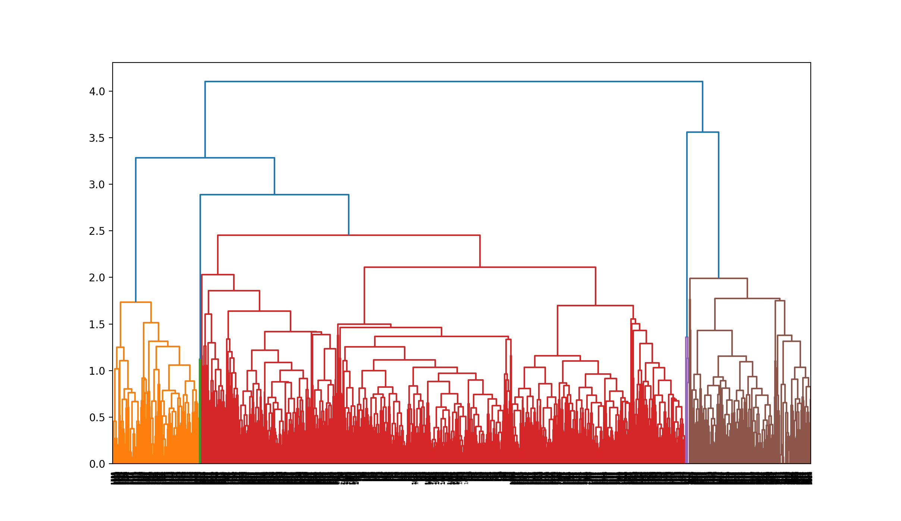
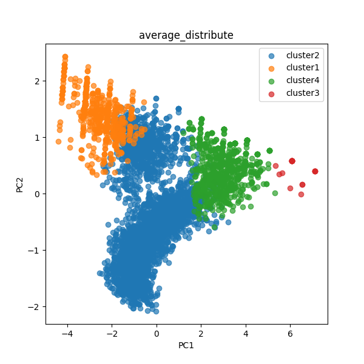
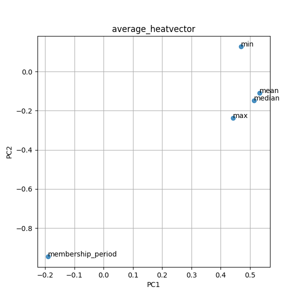

# 統計分析法 第三回レポート

## 実行環境

python3.9.9

- pipenv

(これ以降のモジュールは`pipenv update`でダウンロードできます)

- pandas(1.3.5)
- matplotlib (3.5.1)
- scikit-learn (1.0.2)

## 分析の流れについて

まず、ファイルからのデータを[src/input_data.py](src/input_data.py)の`input_data`メソッド内で`pandas.read_csv`メソッドを用いて`DataFrame`を作成し、その中で名義変数である`customer_id`を削除した。

また、それらのデータを正規化したものも作成した。

データをそれぞれの手法でクラスタリングした後、データの解析と表示を行った。

まず、[src/analyze.py](src/analyze.py)内の`analyze_data`関数内で変数名を変更したものと、各クラスタごとに統計情報をそれぞれcsvファイルに出力した。

また、[src/visilze.py](src/visilze.py)内の`plot_data`メソッドでデータと名義変数に主成分分析を行い、2次元上にプロットした。

## k-meansでの分析

`sklearn.cluster`内の`KMeans`メソッドを用いて行った。

ソースコードは[k-menas.py](k_means.py)である。

### 実行結果

k-means.pyの実行結果,k-meansでのクラスタの分布、変数の寄与率をそれぞれ出力1、図1,図2に示す。

出力1 : k-means.pyの出力結果

<!-- [[[cog
import cog
import subprocess
file='k_means.py'
command = f'pipenv run python3 {file}'
cp = subprocess.run(command, encoding='utf-8',
                        stdout=subprocess.PIPE, shell=True,check=True)
cog.outl("\n```text")
cog.outl(f"$ {command}")
cog.outl(cp.stdout)
cog.outl("```")
    ]]] -->

```text
$ pipenv run python3 k_means.py
       mean  median  max  min  membership_period  cluster
0  4.833333     5.0    8    2                 47        1
1  5.083333     5.0    7    3                 47        1
2  4.583333     5.0    6    3                 47        1
3  4.833333     4.5    7    2                 47        1
4  3.916667     4.0    6    1                 47        1
clusters:
3    1332
1    1249
0     840
2     771
Name: cluster, dtype: int64
explained_varience_radio_ :[0.69042666 0.18937526]
compopnents :
[[ 0.53265024  0.51384531  0.44183117  0.47001365 -0.19005026]
 [-0.10971924 -0.14919798 -0.23674476  0.12782904 -0.94515253]]
mean :
[ 3.79679324e-16  1.35599759e-16 -5.42399035e-17 -1.08479807e-16
 -5.42399035e-17]
covariance :
[[ 1.13217687  0.90245414  0.78486328  0.80381952 -0.25182324]
 [ 0.90245414  1.07580128  0.76481806  0.77130299 -0.21233606]
 [ 0.78486328  0.76481806  0.87718191  0.65285429 -0.10603252]
 [ 0.80381952  0.77130299  0.65285429  0.93111606 -0.38075827]
 [-0.25182324 -0.21233606 -0.10603252 -0.38075827  0.98491692]]
component:
         mean    median       max       min  membership_period
PC1  0.532650  0.513845  0.441831  0.470014          -0.190050
PC2 -0.109719 -0.149198 -0.236745  0.127829          -0.945153

```
<!-- [[[end]]] -->

また、クラスタの分布の詳細、クラスタごとの統計の詳細は、それぞれ[output/k-means_clustering.csv](output/k-means_clustering.csv),[output/k-means_describe.csv](output/k-means_describe.csv)でみることができる。



図1 k-meansでのクラスタの分布


図2 k-meansでの変数に対する主成分の寄与率

図2より、月内利用回数の平均値、中央値のPC1の値が大きく、利用期間のPC2の値が小さい。そのため、k-meansでの2つの主成分は順に利用回数の多い常連、利用期間が長い古参であると考えられる。

その上で図1を見ると、それぞれのクラスタは1番目から順に、長く利用しているがあまり利用していない客層、加入したばかりであまり利用していない客層、利用回数は少なくなく、利用期間も幅がある通常利用客、利用回数が多い常連層だと考えられる。

## 凝集型階層的クラスタリングでの分析

まず、`scipy.cluster.hierarchy`内の`linkage`メソッドを用いてテンドログラムを作成し、`scipy.cluster.hierarchy`内の`dendrogram`メソッドを用いてテンドログラムを表示した。

また、`linkage`メソッドの返り値は[`クラスタA`,`クラスタB`,`2つのクラスタ間の距離`,`いま時点での併合したクラスタに含まれるデータ数`]の2次元配列となり、これが併合される順番に格納されている。

今回行う3つのクラスタ間の計算方法は単調であることが保証されているため、最後から3番目の値をクラスタリングのしきい値とした。

その値を元に、`scipy.cluster.hierarchy`内の`fcluster`メソッドを用いてクラスタリングを行った。

ソースコードは[src/hierarchical_clustering.py](src/hierarchical_clustering.py)である。

### 単連結法でのクラスタリング

ソースコードは[single.py](single.py)である。

#### 実行結果

single.pyの実行結果,単連結法のテンドログラム、単連結法でのクラスタの分布、変数の寄与率をそれぞれ出力2、図3,図4,図5に示す。

出力2 : single.pyの出力結果

<!-- [[[cog
import cog
import subprocess
file='single.py'
command = f'pipenv run python3 {file}'
cp = subprocess.run(command, encoding='utf-8',
                        stdout=subprocess.PIPE, shell=True,check=True)
cog.outl("\n```text")
cog.outl(f"$ {command}")
cog.outl(cp.stdout)
cog.outl("```")
    ]]] -->

```text
$ pipenv run python3 single.py
       mean  median  max  min  membership_period  cluster
0  4.833333     5.0    8    2                 47        3
1  5.083333     5.0    7    3                 47        3
2  4.583333     5.0    6    3                 47        3
3  4.833333     4.5    7    2                 47        3
4  3.916667     4.0    6    1                 47        3
clusters:
3    4174
2      13
1       4
4       1
Name: cluster, dtype: int64
explained_varience_radio_ :[0.69042666 0.18937526]
compopnents :
[[ 0.53265024  0.51384531  0.44183117  0.47001365 -0.19005026]
 [-0.10971924 -0.14919798 -0.23674476  0.12782904 -0.94515253]]
mean :
[ 3.79679324e-16  1.35599759e-16 -5.42399035e-17 -1.08479807e-16
 -5.42399035e-17]
covariance :
[[ 1.13217687  0.90245414  0.78486328  0.80381952 -0.25182324]
 [ 0.90245414  1.07580128  0.76481806  0.77130299 -0.21233606]
 [ 0.78486328  0.76481806  0.87718191  0.65285429 -0.10603252]
 [ 0.80381952  0.77130299  0.65285429  0.93111606 -0.38075827]
 [-0.25182324 -0.21233606 -0.10603252 -0.38075827  0.98491692]]
component:
         mean    median       max       min  membership_period
PC1  0.532650  0.513845  0.441831  0.470014          -0.190050
PC2 -0.109719 -0.149198 -0.236745  0.127829          -0.945153

```
<!-- [[[end]]] -->

また、データのテンドログラム、クラスタの分布の詳細、クラスタごとの統計の詳細は、それぞれ[output/single_dendrogram_data.csv](output/single_dendrogram_data.csv),[output/single_clustering.csv](output/single_clustering.csv),[output/single_describe.csv](output/single_describe.csv)でみることができる。



図3 単連結法でのテンドログラム



図4 単連結法でのクラスタの分布


図5 単連結法での変数に対する主成分の寄与率

変数の解釈についてはk-meansと同様であるため省略する。

図3を見ると、空間濃縮が起こりやすい性質であるためか、チェイニングが発生し、一つの大きなクラスタにデータが取り込まれている状態になっている。

その上で図4を見ると、一つの大きなクラスタがあり、残りの最後のクラスタに取り込まれたデータがそれぞれクラスタとなっている。

### 完全連結法でのクラスタリング

ソースコードは[complete.py](complete.py)である。

#### 実行結果

complete.pyの実行結果,完全連結法のテンドログラム、完全連結法でのクラスタの分布、変数の寄与率をそれぞれ出力3、図6,図7,図8に示す。

出力3 : complete.pyの出力結果

<!-- [[[cog
import cog
import subprocess
file='complete.py'
command = f'pipenv run python3 {file}'
cp = subprocess.run(command, encoding='utf-8',
                        stdout=subprocess.PIPE, shell=True,check=True)
cog.outl("\n```text")
cog.outl(f"$ {command}")
cog.outl(cp.stdout)
cog.outl("```")
    ]]] -->

```text
$ pipenv run python3 complete.py
       mean  median  max  min  membership_period  cluster
0  4.833333     5.0    8    2                 47        4
1  5.083333     5.0    7    3                 47        4
2  4.583333     5.0    6    3                 47        4
3  4.833333     4.5    7    2                 47        4
4  3.916667     4.0    6    1                 47        4
clusters:
4    2267
3    1031
2     862
1      32
Name: cluster, dtype: int64
explained_varience_radio_ :[0.69042666 0.18937526]
compopnents :
[[ 0.53265024  0.51384531  0.44183117  0.47001365 -0.19005026]
 [-0.10971924 -0.14919798 -0.23674476  0.12782904 -0.94515253]]
mean :
[ 3.79679324e-16  1.35599759e-16 -5.42399035e-17 -1.08479807e-16
 -5.42399035e-17]
covariance :
[[ 1.13217687  0.90245414  0.78486328  0.80381952 -0.25182324]
 [ 0.90245414  1.07580128  0.76481806  0.77130299 -0.21233606]
 [ 0.78486328  0.76481806  0.87718191  0.65285429 -0.10603252]
 [ 0.80381952  0.77130299  0.65285429  0.93111606 -0.38075827]
 [-0.25182324 -0.21233606 -0.10603252 -0.38075827  0.98491692]]
component:
         mean    median       max       min  membership_period
PC1  0.532650  0.513845  0.441831  0.470014          -0.190050
PC2 -0.109719 -0.149198 -0.236745  0.127829          -0.945153

```
<!-- [[[end]]] -->

また、データのテンドログラム、クラスタの分布の詳細、クラスタごとの統計の詳細は、それぞれ[output/complete_dendrogram_data.csv](output/complete_dendrogram_data.csv),[output/complete_clustering.csv](output/complete_clustering.csv),[output/complete_describe.csv](output/complete_describe.csv)でみることができる。



図6 完全連結法でのテンドログラム



図7 完全連結法でのクラスタの分布


図8 完全連結法での変数に対する主成分の寄与率

変数の解釈についてはk-meansと同様であるため省略する。

図6を見ると、空間拡散が起こりやすい性質であるためか、各クラスタがやや均等の大きさになっていることがわかる。

その上で図8を見ると、それぞれのクラスタは1番目から順に、積極的に利用している法人などの大口の客層、比較的長く利用しており、そこそこ利用している客層、最近利用し始めたばかりである新規の客層、あまり利用していない、レジャー目的などで利用している客層だと考えられる。

### 群平均法でのクラスタリング

ソースコードは[average.py](average.py)である。

#### 実行結果

average.pyの実行結果,群平均法のテンドログラム、群平均法でのクラスタの分布、変数の寄与率をそれぞれ出力4、図9,図10,図11に示す。

出力4 : average.pyの出力結果

<!-- [[[cog
import cog
import subprocess
file='average.py'
command = f'pipenv run python3 {file}'
cp = subprocess.run(command, encoding='utf-8',
                        stdout=subprocess.PIPE, shell=True,check=True)
cog.outl("\n```text")
cog.outl(f"$ {command}")
cog.outl(cp.stdout)
cog.outl("```")
    ]]] -->

```text
$ pipenv run python3 average.py
       mean  median  max  min  membership_period  cluster
0  4.833333     5.0    8    2                 47        2
1  5.083333     5.0    7    3                 47        2
2  4.583333     5.0    6    3                 47        2
3  4.833333     4.5    7    2                 47        2
4  3.916667     4.0    6    1                 47        2
clusters:
2    2919
4     728
1     521
3      24
Name: cluster, dtype: int64
explained_varience_radio_ :[0.69042666 0.18937526]
compopnents :
[[ 0.53265024  0.51384531  0.44183117  0.47001365 -0.19005026]
 [-0.10971924 -0.14919798 -0.23674476  0.12782904 -0.94515253]]
mean :
[ 3.79679324e-16  1.35599759e-16 -5.42399035e-17 -1.08479807e-16
 -5.42399035e-17]
covariance :
[[ 1.13217687  0.90245414  0.78486328  0.80381952 -0.25182324]
 [ 0.90245414  1.07580128  0.76481806  0.77130299 -0.21233606]
 [ 0.78486328  0.76481806  0.87718191  0.65285429 -0.10603252]
 [ 0.80381952  0.77130299  0.65285429  0.93111606 -0.38075827]
 [-0.25182324 -0.21233606 -0.10603252 -0.38075827  0.98491692]]
component:
         mean    median       max       min  membership_period
PC1  0.532650  0.513845  0.441831  0.470014          -0.190050
PC2 -0.109719 -0.149198 -0.236745  0.127829          -0.945153

```
<!-- [[[end]]] -->

また、データのテンドログラム、クラスタの分布の詳細、クラスタごとの統計の詳細は、それぞれ[output/average_dendrogram_data.csv](output/average_dendrogram_data.csv),[output/average_clustering.csv](output/average_clustering.csv),[output/average_describe.csv](output/average_describe.csv)でみることができる。



図9 群平均法でのテンドログラム



図10 群平均法でのクラスタの分布



図11 群平均法での変数に対する主成分の寄与率

変数の解釈についてはk-meansと同様であるため省略する。

図9を見ると、単連結法の空間濃縮が起こりやすい性質と、完全連結法の空間拡散が起こりやすい性質を混ぜ合わせたようなテンドログラムになっている。

その上で図10を見ると、それぞれのクラスタは1番目から順に、最近利用し始めたばかりであまり利用していない新規の客層、あまり利用しておらず、レジャー目的などで利用している客層、積極的に利用している法人などの大口の客層、そこそこ利用している客層、だと考えられる。

## k-meansと凝集型階層的クラスタリングとの比較

k-meansでは、中心からの距離ができるだけ小さくなるようにクラスタを作るため、クラスタの境目は直線的になりやすい。

その一方で、凝集型階層的クラスタリングでは性質が似ているもの同士を順にまとめていくため、クラスタの境目は直線的にはなりにくいが、距離の決め方によっては大きなクラスタができることもある。
